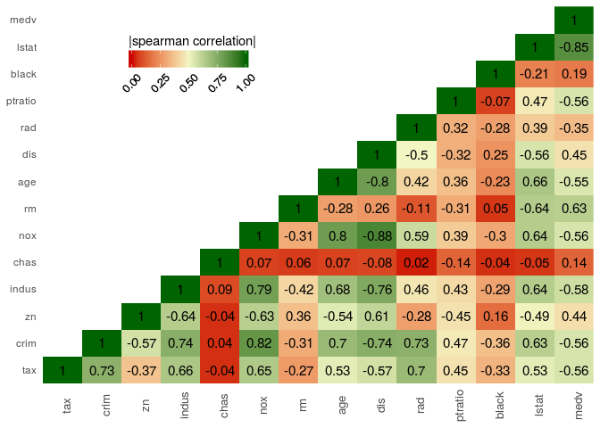

plot\_correlation
================
Damien C. Jacques

Demo of `plot_correlation` function.

``` r
library(MASS)
data(Boston)
```

``` r
g <- plot_correlation(Boston, var = "tax", method = "spearman")
```

    ## Loading required package: ggplot2

    ## Loading required package: reshape2

``` r
g
```


