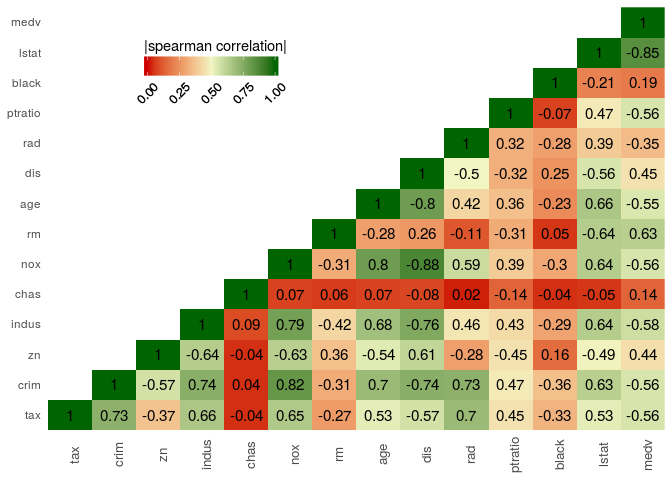

Functions demo using sample data
================
Damien C. Jacques

[`plot_correlation`](https://github.com/damienjacques/R-function/blob/master/Plot-Functions/plot_correlation.R)
---------------------------------------------------------------------------------------------------------------

``` r
library(MASS)
data(Boston)
```

``` r
g <- plot_correlation(Boston, var = "tax", method = "spearman")
```

    ## Loading required package: ggplot2

    ## Loading required package: reshape2

``` r
g
```


